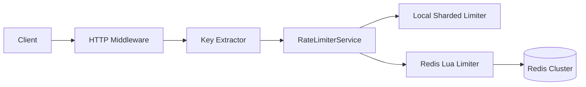

# Architecture Diagram

```mermaid
flowchart LR
    C[Client] --> M[HTTP Middleware]
    M --> K[Key Extractor]
    K --> S[RateLimiterService]
    S --> L[Local Sharded Limiter]
    S --> R[Redis Lua Limiter]
    R --> RC[(Redis Cluster)]
```
